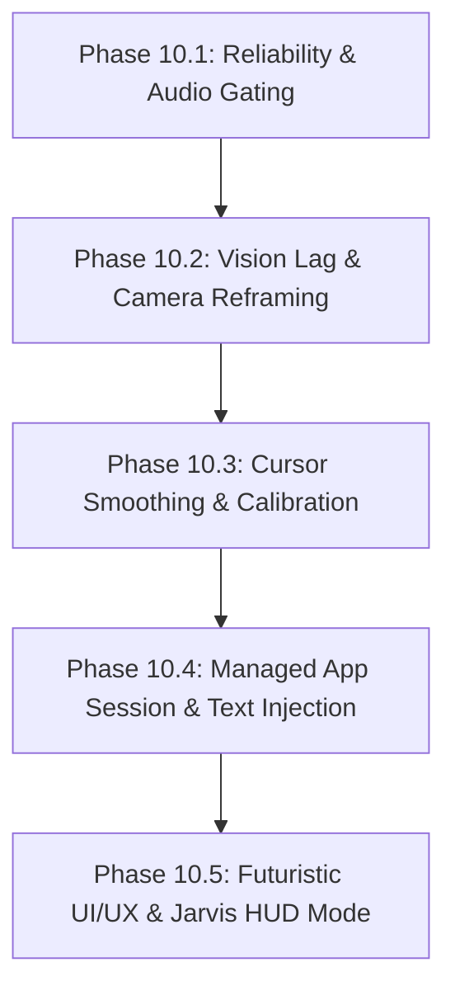

# AETHER-OS: Core Enhancement & Refactoring Master Specification

**Document Version:** 1.0.0  
**Status:** ACTIVE SPECIFICATION & ROADMAP  
**Author:** AETHER-OS Engineering Team  
**Scope:** UI/UX Overhaul, Vision Optimization, Gesture Control, Voice Loop Suppression, and Desktop Automation Resilience

---

## 1. Executive Summary & Vision

This specification defines the architectural improvements, feature enhancements, and bug resolutions requested for **AETHER-OS**. The objective is to elevate AETHER-OS from a prototype runtime to a high-performance, aesthetically stunning, low-latency cybernetic operating assistant capable of smooth visual tracking, intelligent voice control, and reliable Windows desktop automation.

---

## 2. Master Itemized Requirements Matrix

| ID | Category | Enhancement / Issue Description | Priority | Target Subsystem |
|---|---|---|---|---|
| **REQ-01** | **Automation** | Prevent duplicate command execution spam (e.g. calculator opening 4–5 times) | **P0** | `CommandManager`, `desktopActionDispatcher` |
| **REQ-02** | **Automation** | Reliable application launching for all targets (VS Code, Notepad, Calc, Browser) | **P0** | `desktopActions.js`, `appRegistry.js` |
| **REQ-03** | **Audio / Voice** | Acoustic echo loop prevention: prevent assistant's voice from triggering microphone input | **P0** | `speech-runtime.ts`, `voiceStore.ts` |
| **REQ-04** | **Audio / Voice** | Instant Speech Synthesis Pause / Interrupt button | **P1** | `AudioVisualizer`, `speech-runtime.ts` |
| **REQ-05** | **Audio / Voice** | Dual-scope voice commands: self-governance (turn on camera, change view) + OS actions | **P1** | `intentProcessor.js`, `cognitiveTrigger.ts` |
| **REQ-06** | **Vision / Tracking**| Camera & landmark lag reduction (displaying face & hand landmarks without frame drops) | **P0** | `VisionCanvas.tsx`, `cameraPipeline.ts` |
| **REQ-07** | **Vision / UX** | Wide 16:9 camera capture with zoomed square UI viewport (prevents hand leaving frame) | **P1** | `CameraStream.tsx`, `VisionCanvas.tsx` |
| **REQ-08** | **Vision / Cursor**| Gesture cursor smoothing & anti-jitter filter (Exponential Moving Average / deadzone) | **P0** | `gestureTracker.ts`, `cursorStore.ts` |
| **REQ-09** | **Vision / Cursor**| Dual-layer virtual cursor: browser DOM pointer + system-wide Windows mouse control | **P1** | `systemControls.js`, `cursorStore.ts` |
| **REQ-10** | **DevTools** | Cursor sensitivity, acceleration, and pinch-click calibration sliders in DevTools | **P2** | `DevToolsModal.tsx`, `ActionInspectorTab.tsx` |
| **REQ-11** | **Vision / UI** | Scanner button repurposing: toggle landmark wireframe/mesh on/off to boost FPS | **P1** | `MainHUD.tsx`, `visionStore.ts` |
| **REQ-12** | **Vision / UI** | "Jarvis HUD Eye Tracking": Left eye animated circle, right eye tactical rectangle | **P2** | `JarvisHUDOverlay.tsx`, `irisTracker.ts` |
| **REQ-13** | **Automation** | Managed Active App Session: cyan boundary aura, voice-driven typing/editing, release lifecycle | **P1** | `appSessionManager.js`, `desktopActions.js` |
| **REQ-14** | **UI / UX** | Complete UI/UX redesign: futuristic Stark/Cyberpunk aesthetic, modern typography, glassmorphism | **P1** | `App.tsx`, `HUDOverlay.tsx`, `index.css` |
| **REQ-15** | **DevTools** | DevTools visual & functional redesign: high-tech telemetry, streamlined inspection tabs | **P2** | `client/src/components/devtools/*` |
| **REQ-16** | **Core Architecture** | Lightweight footprint, zero-bloat deployment, low CPU/GPU load (Ponytail principle) | **P0** | Entire Repo Architecture |

---

## 3. Detailed Technical Specifications

### REQ-01: Command Debouncing & Duplicate Prevention
- **Root Cause:** Fast speech transcription updates emit multiple `speech_final` events; concurrent clicks in UI trigger parallel socket packets without server-side deduplication.
- **Architectural Solution:**
  1. **Client-side Action Debounce:** In `desktopActionDispatcher.ts`, implement a 1200ms per-target sliding debounce window. If an action with identical `type` and `target` is dispatched within 1200ms, coalesce it into a single promise.
  2. **Server-side Mutex / Cooldown Table:** In `commandManager.js`, enforce an in-flight lock table `activeTargets = Map<string, timestamp>`. Reject or queue duplicate launches of the same executable while one is actively spawning or within a 1500ms cooldown.

### REQ-02: Resilient App Launcher & Fallback Resolution
- **Root Cause:** Path resolution differences between Windows 10/11 packaged apps (`WindowsApps`), Win32 paths, and user local AppData paths (e.g. VS Code installed at `C:\Users\<User>\AppData\Local\Programs\Microsoft VS Code\Code.exe`).
- **Architectural Solution:**
  1. **Multi-tier Resolver:**
     - *Tier 1:* Canonical Win32 executable execution via `Shell.Application.ShellExecute(target, '', '', 'open', 1)`.
     - *Tier 2:* Path expansion looking into `%LOCALAPPDATA%\Programs\...` (e.g. `Code.exe`), `%PROGRAMFILES%`, and `C:\Windows\System32`.
     - *Tier 3:* Protocol URI activation (`vscode://`, `calc:`, `spotify:`, `ms-settings:`).
     - *Tier 4:* PowerShell `Start-Process` with fallback error capture.

### REQ-03: Acoustic Echo Loop Prevention (Assistant Self-Hearing)
- **Problem Statement:** Assistant reads out confirmation loudly through speakers; microphone transcribes speaker output as a new user command, resulting in infinite feedback loops.
- **Architectural Solution:**
  1. **Hardware/Software Audio Gating:**
     - Hook into `useConversationStore.getState().isSpeaking` and `window.speechSynthesis.speaking`.
     - When `isSpeaking === true`:
       - Temporarily abort or mute `SpeechRecognition` instance (`recognition.abort()` or silence audio track).
       - Maintain a speech cooldown timestamp (`lastSpokenTime`). Any transcript arriving within `playbackDuration + 800ms` is discarded if its similarity to the assistant utterance exceeds 60%.
     - Once speech playback ends (`utterance.onend`), delay 500ms before unmuting recognition.

### REQ-04: Instant Speech Interrupt / Pause Controls
- **Problem Statement:** User cannot quickly stop Aether when it speaks a long response.
- **Architectural Solution:**
  1. **Global TTS Interrupt Action:** Add an accessible "Pause / Stop Speaking" button on the main HUD audio visualizer.
  2. **Keyboard Shortcut:** Pressing `Escape` or `Space` (when not in an input box) immediately invokes `window.speechSynthesis.cancel()`.
  3. **Voice Barge-in:** If user begins speaking a wake phrase while assistant is talking, abort TTS immediately.

### REQ-05: Dual-Scope Voice Commands (Inner OS & Outer Automation)
- **Problem Statement:** Voice commands currently only target external OS apps or generic chat responses; user cannot command Aether's internal interface (e.g., "turn on camera", "open devtools", "change view").
- **Architectural Solution:**
  1. **Unified Intent Dispatcher:**
     - *Internal Commands:*
       - `"turn on camera"` / `"start vision"` -> `useVisionStore.getState().startCamera()`
       - `"turn off camera"` -> `useVisionStore.getState().stopCamera()`
       - `"open devtools"` / `"show inspector"` -> `useUIStore.getState().setDevToolsOpen(true)`
       - `"switch to action inspector"` -> `useUIStore.getState().setActiveDevToolsTab(12)`
       - `"toggle landmarks"` / `"hide mesh"` -> `useVisionStore.getState().toggleLandmarks()`
       - `"engage jarvis mode"` -> `useUIStore.getState().setJarvisMode(true)`
     - *External Commands:* Dispatched via `desktopActionDispatcher.dispatchFromIntent()`.

### REQ-06 & REQ-07: Camera Performance & Aspect-Ratio Cropping
- **Problem Statement:** Hand tracking drops off when user moves hands outside the camera box; rendering landmarks on every frame causes 10x lag.
- **Architectural Solution:**
  1. **Capture FOV vs Display Framing:**
     - Native webcam stream requests `1280x720` or `1920x1080` (16:9 wide aspect ratio).
     - MediaPipe / Vision Engine receives the entire 16:9 frame, tracking hands in peripheral zones without user having to keep hands in front of their chest.
     - The UI camera feed is styled with `aspect-ratio: 1 / 1` (or 4:3) with `object-fit: cover; object-position: center`.
     - The user sees a tight, aesthetic camera portrait of their face/torso, while hand tracking operates freely across the wider peripheral bounds.
  2. **Render Loop Decoupling:**
     - Decouple landmark canvas drawing from MediaPipe detection ticks. Use `requestAnimationFrame` and skip canvas redraws if data has not changed.
     - Simplify SVG/Canvas paths: replace individual circle draws with batched `Path2D` strokes.

### REQ-08 & REQ-09: Cursor Smoothing & System-wide Pointer
- **Problem Statement:** Hand cursor jitters rapidly, flies off screen, or disappears on minor hand movements.
- **Architectural Solution:**
  1. **Filter Pipeline:**
     - **Exponential Moving Average (EMA):** $P_t = \alpha \cdot P_{raw} + (1 - \alpha) \cdot P_{t-1}$ where $\alpha = 0.35$.
     - **Deadzone Threshold:** Movements $< 4\text{px}$ are ignored to eliminate hand micro-tremors during pointing.
     - **Velocity Clamping:** Maximum delta per frame is clamped to prevent teleporting when tracking briefly drops.
     - **Pinch-to-Click Hysteresis:** Distance between index finger and thumb has dual thresholds: enter click at $< 0.04$, release at $> 0.07$.
  2. **System-wide Windows Cursor:**
     - When "Host OS Control" is enabled, frontend streams cursor coordinates via socket event `os:cursor_move`.
     - Server uses native Windows `user32.dll SetCursorPos(x, y)` and `mouse_event(MOUSEEVENTF_LEFTDOWN / LEFTUP)`.

### REQ-10: Cursor Calibration Console in DevTools
- Add an interactive calibration module in DevTools:
  - Horizontal & Vertical Sensitivity sliders ($0.5\times$ to $3.0\times$)
  - Jitter Dampening / Smoothing slider ($0.1$ to $0.9$)
  - Pinch Detection Threshold slider
  - Real-time Visual Test Pad showing raw vs smoothed pointer coordinates

### REQ-11: Scanner Button Repurposing (Landmark Mesh Toggle)
- **Problem Statement:** The center "Scanner" button has no practical function and wastefully consumes CPU cycles.
- **Architectural Solution:**
  - Repurpose the Scanner button into **"Mesh Telemetry Toggle"**:
    - **Active (Glow Cyan):** Renders hand and facial landmark wireframe points on the camera canvas.
    - **Inactive (Stealth Dim):** Shuts off landmark canvas rendering while maintaining underlying gesture calculation in the background, slashing GPU/CPU usage and eliminating rendering lag.

### REQ-12: Jarvis Combat / Tactical Eye Targeting HUD
- **Feature Design:**
  - When enabled via button or `"Jarvis mode"` voice trigger:
    - Iris landmark tracking identifies left and right eye center coordinates.
    - **Left Eye:** Renders an animated rotating circular reticle with cardinal ticks and rangefinder ring.
    - **Right Eye:** Renders a tactical targeting rectangle with bracket corners and focus telemetry text.
    - UI transitions into Stark Industries / Jarvis dark-slate and electric cyan theme with sound effect cues.

### REQ-13: Managed App Session & Aura Overlay
- **Feature Design:**
  - When Aether opens an application (e.g. Notepad, VS Code):
    - Registers the app as the **Active Managed Target** (`activeAppSession = { id, name, pid }`).
    - Displays a glowing light-blue aura / border around the application status indicator in the UI.
    - Enables contextual speech commands:
      - *"Write a simple HTML page in Notepad"* -> Injects text via Windows clipboard / keystrokes.
      - *"Write 10 words about me"* -> LLM generates content and types it directly into the active app.
    - Saying *"Close the app"* terminates the process; saying *"Release app"* removes the managed aura and yields control back to manual user interaction.

### REQ-14 & REQ-15: Futuristic UI/UX Overhaul
- **Design Aesthetic Guidelines:**
  - Curated palette: Deep Void (`#040711`), Carbon Slate (`#0b101d`), Electric Cyan (`#00f0ff`), Quantum Teal (`#00d4aa`), Neon Violet (`#7928ca`).
  - Typography: Futuristic geometric sans-serif (Orbitron / Inter / JetBrains Mono).
  - Glassmorphic panels with subtle backdrop blur (`backdrop-filter: blur(16px)`), micro-borders (`border: 1px solid rgba(0, 240, 255, 0.12)`), and glowing accents.
  - Interactive micro-animations for state transitions (hover, active, audio reactive pulses).

### REQ-16: Low-Latency, Lightweight Architecture
- Follow the **Ponytail** engineering philosophy:
  - Zero heavy or redundant external dependencies.
  - Rely on native browser Web APIs (`SpeechRecognition`, `speechSynthesis`, `requestAnimationFrame`, `Canvas2D`).
  - Standard Windows platform APIs (`user32.dll`, `Shell.Application`) via Node.js stdlib `child_process`.
  - Maintain clean bundle sizes and ultra-fast boot times.

---

## 4. Implementation Phasing Plan

### Phase 10.1: Immediate Stability & Audio Gating
1. Fix duplicate command emission (cooldown table in server + debouncing in client).
2. Fix app launcher paths and executable resolution for VS Code, Notepad, and Chrome.
3. Implement acoustic echo cancellation / mic mute during SpeechSynthesis playback.
4. Add speech pause/cancel button and keyboard shortcut.

### Phase 10.2: Vision Performance & Camera Reframing
1. Implement wide 16:9 capture with 1:1 zoomed UI cropping.
2. Optimize landmark canvas render loop with `Path2D` and frame skipping.
3. Repurpose Scanner button to toggle landmark rendering on/off.

### Phase 10.3: Precision Cursor & Calibration
1. Implement Exponential Moving Average (EMA) and deadband jitter reduction.
2. Add sensitivity, smoothing, and pinch threshold controls in DevTools.
3. Enable system-wide Windows mouse control via `SetCursorPos`.

### Phase 10.4: Managed App Session & Automation
1. Implement active application session lifecycle (`attach`, `inject_text`, `release`, `close`).
2. Add contextual voice commands ("type ...", "write code for ...").

### Phase 10.5: Premium Futuristic UI/UX Overhaul
1. Overhaul main application HUD with cybernetic glassmorphic aesthetics.
2. Implement Jarvis Eye-Tracking HUD (left circular reticle, right tactical bracket).
3. Redesign DevTools with unified high-tech telemetry.

---

## 5. Verification & Acceptance Criteria
- [ ] Calculator, Notepad, and VS Code open exactly **once** per voice command with zero duplicate spam.
- [ ] Speaking assistant does not trigger its own microphone input.
- [ ] Pressing pause or Escape stops SpeechSynthesis immediately.
- [ ] Hand can move freely in peripheral bounds without leaving camera tracking frame.
- [ ] Camera runs smoothly with zero perceptible lag when mesh rendering is toggled off.
- [ ] Virtual finger cursor moves fluidly like a physical mouse without erratic snapping.
- [ ] Jarvis mode renders left circle and right rectangle over eyes on webcam.
- [ ] All automated unit and E2E test suites pass with zero regressions.
