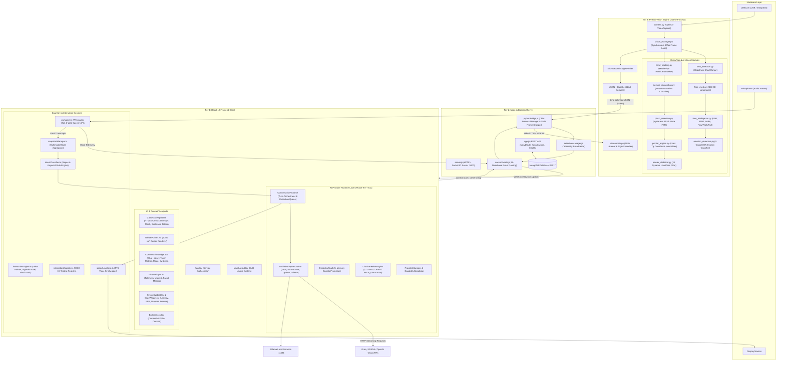

# AETHER OS — Master Architecture Overview

> **Subsystem**: System Architecture & Inter-Process Orchestration  
> **Status**: Comprehensive Engineering Documentation  
> **Scope**: Frontend (React/TS), Backend (Node.js/Socket.IO), Computer Vision (Python/MediaPipe), and AI Runtime Layer  

---

## 1. Executive Summary & System Philosophy

**AETHER OS** is an ambient, multimodal spatial operating system and AI interaction platform designed to bridge physical human perception (vision, gaze, facial expressions, hand gestures, spatial pinch interactions, voice) with cognitive reasoning engines (LLMs like Groq Llama 3.3, NVIDIA NIM, OpenAI GPT-4o, and local Ollama instances) and local desktop automation.

The system is organized into a **tri-tier hybrid architecture**:
1. **Frontend (React 19 + TypeScript + Vite 8 + Tailwind CSS v4 + Zustand 5)**: High-performance glassmorphic HUD operating environment, 60fps spatial cursor tracking, Web Audio VAD, Speech Recognition/TTS, and canvas-based neural overlays.
2. **Backend (Node.js + Express + Socket.IO + Child Process Orchestration)**: Low-latency telemetry message bus, session isolation, MongoDB authentication, and lifecycle controller for local hardware and vision sub-engines.
3. **Computer Vision Subsystem (Python 3.10+ + MediaPipe + OpenCV + OneEuro Filtering)**: Real-time multi-model vision pipeline executing face detection, 468-point face mesh, emotion heuristic intelligence, 21-point hand tracking, gesture classification, and stabilized virtual pointer calculation.

---

## 2. High-Level Architecture Diagram



---

## 3. Detailed Data Flow & Communication Topology

### 3.1 Vision Pipeline Data Flow (Hardware $\rightarrow$ Screen)

```
[Webcam Capture (OpenCV)]
         │
         ▼
[MediaPipe Detection Pipeline: Face + 468 Mesh + 21 Hand Landmarks]
         │
         ▼
[Heuristic Feature Extraction: Emotions + Gestures + Pinch FSM + 1€ Filtered Pointer]
         │
         ▼
[JPEG (Quality 80) + Base64 Encoding + Execution Profiler Timestamping]
         │
         ▼ (stdout IPC via newline-delimited JSON)
[Node.js PythonBridge: readline parser -> Stale Frame Filter (Age > 100ms dropped)]
         │
         ▼ (Socket.IO emit 'vision:update')
[Browser Socket Client: Age check (>150ms dropped) -> Image Decode]
         │
         ├──► [HTML5 Canvas: Face Mesh Lines, Hand Skeletons, Bounding Boxes, HUD Filters]
         ├──► [Zustand Stores: cameraStore, visionStore, systemStore]
         └──► [GlobalPointer: rAF 60fps Screen-Space Spatial Cursor]
```

### 3.2 Voice & Intent Pipeline Data Flow

```
[Microphone Audio Stream]
         │
         ├──► [Web Audio API AnalyserNode: RMS Volume Calculation & VAD Detection]
         │          │
         │          ▼ (Throttled 10Hz socket emit 'voice:telemetry')
         │     [Server & Peer Sync]
         │
         └──► [webkitSpeechRecognition: Interim & Final Transcripts]
                    │
                    ▼ ('speech_final' event triggered)
         [SnapshotManager: PerceptionSnapshot Created]
                    │
                    ▼
         [IntentClassifier: Deterministic Pattern & Keyword Matching]
                    │
                    ▼
         [ConversationRuntime: ExecutionQueue.enqueue()]
                    │
                    ▼
         [UnifiedAdapterRuntime: Selects Provider -> Groq/NVIDIA/OpenAI API]
                    │
                    ▼ (Streaming Token Feed)
         [ConversationWidget UI Update + Browser SpeechSynthesis (TTS)]
```

---

## 4. Subsystem Breakdown & File Layout

| Subsystem | Primary Technologies | Entry Points | Key Responsibilities |
| :--- | :--- | :--- | :--- |
| **Frontend** | React 19, TypeScript, Tailwind CSS v4, Zustand 5, Vite 8 | `client/src/main.tsx`, `client/src/app/App.tsx` | Glassmorphic HUD rendering, Canvas visualizer, Spatial pointer, AI chat, State management |
| **AI Runtime** | TypeScript, Vitest, EventEmitters | `client/src/runtime/index.ts`, `client/src/types/` | Provider routing, Credential vault, Circuit breakers, Request translation, Stream parsing |
| **Backend** | Node.js, Express, Socket.IO, Mongoose | `server/src/server.js`, `server/src/app.js` | WebSocket server, Python child process management, Telemetry distribution, User auth |
| **Vision Subsystem** | Python 3.10+, OpenCV, MediaPipe, NumPy | `vision/main.py`, `vision/vision_manager.py` | Hardware camera capture, Face & Hand landmark detection, Gesture recognition, 1€ filter pointer |

---

## 5. Process Lifecycle Management

1. **Startup Phase**:
   - Backend boots HTTP Express server and binds Socket.IO on port `5000`.
   - Node connects to MongoDB at `mongodb://localhost:27017/aether_os`.
   - The Python vision pipeline remains **idle/stopped** to avoid unnecessary CPU/GPU and hardware webcam locking.
2. **Client Attachment**:
   - Browser client connects via Socket.IO, acknowledges connection via `client:connected`, and initiates 10s heartbeat ping-pong.
   - Frontend starts `interactionEngine`, `snapshotManager`, `intentManager`, `promptManager`, and `runtimeController`.
3. **Camera Activation**:
   - User toggles video sensor in `BottomDock.tsx` $\rightarrow$ emits `camera:start`.
   - Backend `pythonBridge.js` spawns `python -u vision/main.py`.
   - Python loads MediaPipe models into memory and starts OpenCV stream.
4. **Camera Deactivation & Disconnection**:
   - User toggles off $\rightarrow$ emits `camera:stop` $\rightarrow$ Node sends `STOP\n` over stdin $\rightarrow$ Python gracefully releases webcam.
   - If user closes the browser tab and `io.engine.clientsCount === 0`, Node automatically kills the Python process to release the camera hardware.
