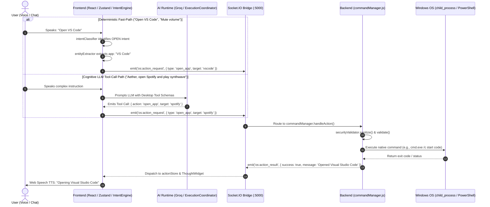

# Phase 10: AI Desktop Task Automation — Architecture Specification

> **Phase**: Phase 10  
> **Status**: APPROVED  
> **Layer**: Tri-Tier (Frontend AI Runtime, Backend Socket/Node, Windows OS)  
> **Date**: September 26, 2026  

---

## 1. System Topology & Data Flow



---

## 2. Action Data Contracts & Schemas

### 2.1 Action Request Schema (`os:action_request`)

```typescript
export interface DesktopActionRequest {
  actionId: string;       // Unique UUID/Nanoid for correlation
  type: DesktopActionType;
  target?: string;        // App name, URL, or target identifier
  params?: {
    query?: string;       // For web search
    url?: string;         // For navigation
    level?: number;       // For volume level (0-100)
    path?: string;        // For filesystem operations
    direction?: 'up' | 'down';
  };
  source: 'intent' | 'llm_tool' | 'manual_ui';
  timestamp: number;
}

export type DesktopActionType =
  | 'open_app'
  | 'close_app'
  | 'search_web'
  | 'open_url'
  | 'adjust_volume'
  | 'mute_volume'
  | 'unmute_volume'
  | 'lock_workstation'
  | 'take_screenshot'
  | 'get_system_info';
```

### 2.2 Action Result Schema (`os:action_result`)

```typescript
export interface DesktopActionResult {
  actionId: string;
  type: DesktopActionType;
  success: boolean;
  message: string;        // Human-readable summary for TTS & UI
  durationMs: number;     // Execution duration
  timestamp: number;
  data?: Record<string, any>;
  error?: string;
}
```

---

## 3. Windows Native Application Registry

The backend registry (`server/src/automation/appRegistry.js`) maps canonical application keys and common voice aliases to executable commands or Windows URI protocol schemes:

| Canonical Key | Voice Aliases | Execution Command / Protocol |
| :--- | :--- | :--- |
| `vscode` | `vs code`, `visual studio code`, `code`, `editor` | `start code` |
| `chrome` | `google chrome`, `chrome`, `browser` | `start chrome` |
| `spotify` | `spotify`, `music player` | `start spotify:` (Windows URI) |
| `notepad` | `notepad`, `notes`, `text editor` | `start notepad` |
| `calculator` | `calc`, `calculator`, `math` | `start calc` |
| `terminal` | `terminal`, `powershell`, `command prompt`, `cmd` | `start wt` (Windows Terminal fallback to `powershell`) |
| `explorer` | `file explorer`, `files`, `my computer`, `explorer` | `start explorer` |
| `settings` | `windows settings`, `settings`, `control panel` | `start ms-settings:` |
| `discord` | `discord` | `start discord:` |
| `slack` | `slack` | `start slack:` |

If an unknown application name is provided, the engine queries the system using `where <name>` or attempts safe execution via `cmd /c start "" "<name>"`.

---

## 4. Web Search & URL Navigator

- **Direct Web Navigation**:
  - `start https://<domain>` launches the system default browser directly to the specified URL.
- **Web Search Engine Formatters**:
  - **Google**: `https://www.google.com/search?q=${encodeURIComponent(query)}`
  - **YouTube**: `https://www.youtube.com/results?search_query=${encodeURIComponent(query)}`
  - **GitHub**: `https://github.com/search?q=${encodeURIComponent(query)}`
  - **StackOverflow**: `https://stackoverflow.com/search?q=${encodeURIComponent(query)}`

---

## 5. System Controls via PowerShell

1. **Volume Adjustment & Mute**:
   - Uses lightweight inline PowerShell COM interfaces (`WScript.Shell` SendKeys `[char]174`/`[char]175`/`[char]173` or direct Windows Core Audio API) for zero external dependencies.
2. **Lock Workstation**:
   - `rundll32.exe user32.dll,LockWorkStation` locks the Windows session safely.
3. **Screenshot Capture**:
   - PowerShell script utilizing `System.Drawing` to capture primary display and save to a designated temporary artifact folder, returning the image path.

---

## 6. Security Sandboxing & Guardrails

To prevent malicious command injection through voice transcripts or LLM hallucinations:
1. **Strict Input Sanitization**:
   - Reject any input containing command chainers or shell metacharacters: `;`, `&`, `|`, `>`, `<`, `` ` ``, `$`, `\n`.
2. **Argument Escaping**:
   - All parameters passed to `child_process.execFile` or `spawn` are strictly passed as array elements, never concatenated directly into raw shell strings.
3. **Execution Whitelist**:
   - File system deletion, format commands, and arbitrary downloaded binary execution are strictly forbidden.
4. **Execution Timeout**:
   - Every OS execution carries a hard 5000ms timeout to avoid hanging processes.
